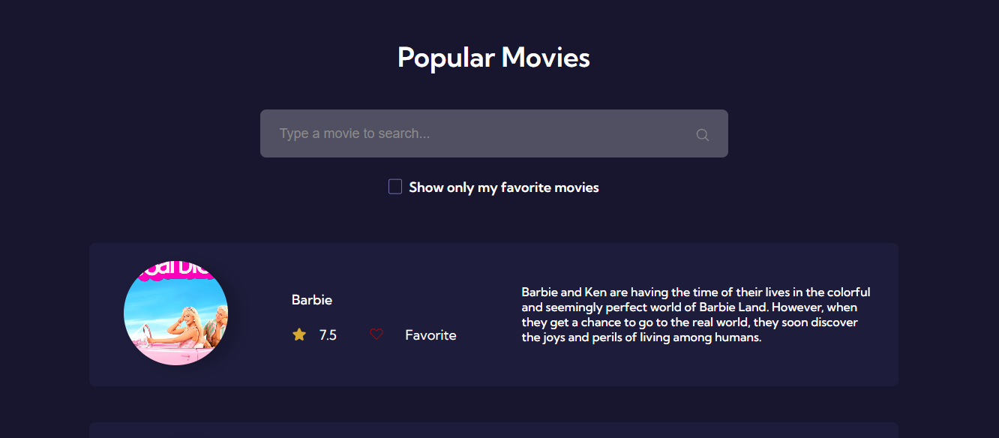

## 
Popular Movies

Plataforma de filmes populares com consumo da API "The Movie DataBase"

 

  

## 🚀 Desenvolvido com:

- REACT
- JavaScript
- CSS
- VITE
- Env
- Git
- Github

Importante: O projeto foi desenvolvido utilizando a API "The Movie DataBase". Para que você consiga executar o projeto localmente é necessário solicitar a sua chave da API no link: https://www.themoviedb.org/settings/api e incluí-la no arquivo .env conforme o .env.example. Caso você deseje ver apenas o funcionamento do projeto, basta clicar no link Live.

## 💻 Projeto:

- [Live](https://consumoapi-filmes.netlify.app/)

 

Coded by Suzane Feitosa ♡ 

 
